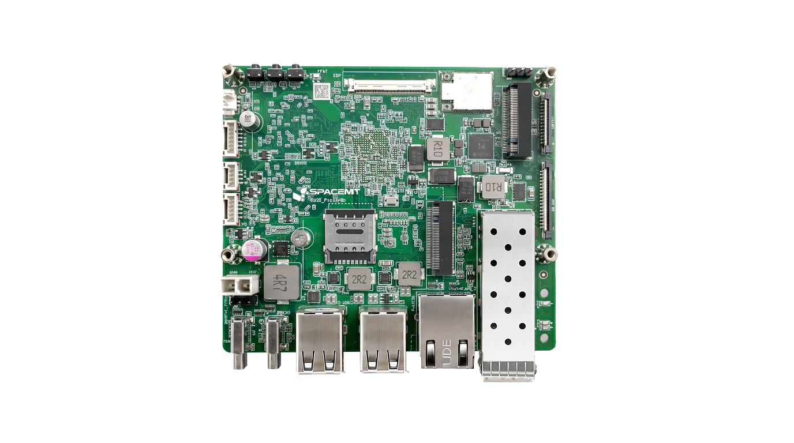
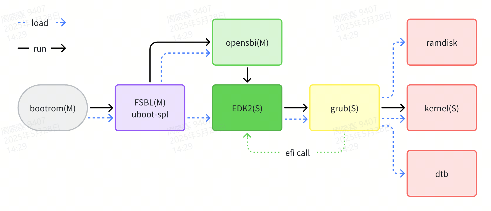

Muse-Pico Platform
=======================

# Summary

This is a port of TianoCore UEFI firmware for the [SpacemiT](https://www.spacemit.com/) [Muse-Pico](https://www.spacemit.com/community/document/info?lang=en&nodepath=hardware/eco/k3_pico/root_overview.md).

The Muse-Pico is a Pico-ITX single-board computer delivering up to 60 TOPS of AI performance. It features a unified memory architecture shared between 8 CPU cores and 8 AI acceleration cores, onboard high-speed UFS storage, and a 10GbE optical networking interface — designed for scientific computing and AI workloads.

# Hardware Supported

Muse-Pico is based on the SpacemiT K3 SoC, a 16-core 64-bit RISC-V AI processor.

**Unified AI Compute**

- 8-core K3 processor compliant with the RVA23 profile, delivering 60 TOPS of AI performance with IME extension and full virtualization support
- Unified memory architecture across CPU and AI cores, enabling deployment of 30B-parameter models

**Ready Out of the Box**

- Onboard UFS storage with speeds up to 3.4× faster than typical eMMC
- Full-featured USB Type-C with 65 W PD and 4K DisplayPort — power and display over a single cable

**Flexible Expansion**

- Dual M.2 slots (B-Key and M-Key); M-Key supports 4-lane PCIe Gen3 for full-bandwidth NVMe SSD
- Integrated 10GbE over PCIe with 10GBASE-R optical interface for low-latency, high-throughput networking and scalable clustering

**Rapid Integration**

- Onboard eDP interface for HD display integration
- Flexible I/O expansion via the RT24 real-time core: EtherCAT, 5× CAN-FD, and other interfaces for microsecond-level motion control and robotics
- MUSE architecture with thermal and workload partitioning for optimal CPU performance and efficiency




# Building

Build firmware using the GCC toolchain.

```bash
# Set environment
export GCC5_RISCV64_PREFIX=riscv64-unknown-linux-gnu-
export PYTHON_COMMAND=python3
export WORKSPACE=$PWD
export PACKAGES_PATH=$WORKSPACE/edk2:$WORKSPACE/edk2-platforms

# Build tools
source edk2/edksetup.sh
make -C edk2/BaseTools

# Build firmware
build -a RISCV64 -p Platform/Spacemit/K3/MUSE-Pico/MUSE-Pico.dsc -t GCC5 -b DEBUG

# Build capsule
build -a RISCV64 -p Platform/Spacemit/K3/MUSE-Pico/MUSE-PicoCapsule.dsc -t GCC5 -D FIRMWARE_IMAGE=./fitimage/MUSE-Pico/MUSE-Pico.itb
```

## Firmware Format

The output firmware image (`.itb`) uses the FIT (Flattened Image Tree) format, which bundles:
- The EDK2 firmware image (`.fd`)
- A DTB file used by both OpenSBI and EDK2


# Booting the Firmware

## Boot Flowchart



## Boot Stages

**BootROM**

The BootROM is built into the SoC. It loads and transfers control to the FSBL.

**FSBL**

> **Note:** The FSBL is built from U-Boot SPL.

The FSBL is responsible for:
- Initializing DDR
- Loading OpenSBI and EDK2 into memory
- Refreshing the memory map and updating the DTB bundled with EDK2

**OpenSBI**

OpenSBI handles platform initialization for Muse-Pico. It runs as an independent firmware stage before EDK2, operating in M-mode as `FW_DYNAMIC`. It initializes platform-specific functions and transitions the subsequent EDK2 environment into S-mode.

**EDK2**

- **SEC**: Builds HOBs for memory, CPU, FV, stack, and processor SMBIOS information, then loads the DXE Core.
- **PEI**: Not present.
- **DXE**: A dispatcher loads drivers and components.
- **TSL**: The EDK2 Shell launches the GRUB2 EFI application, which loads the OS from the target partition.

# Limitations

## ACPI

ACPI support for Muse-Pico devices is not yet implemented. Hardware is currently described via DTB.
